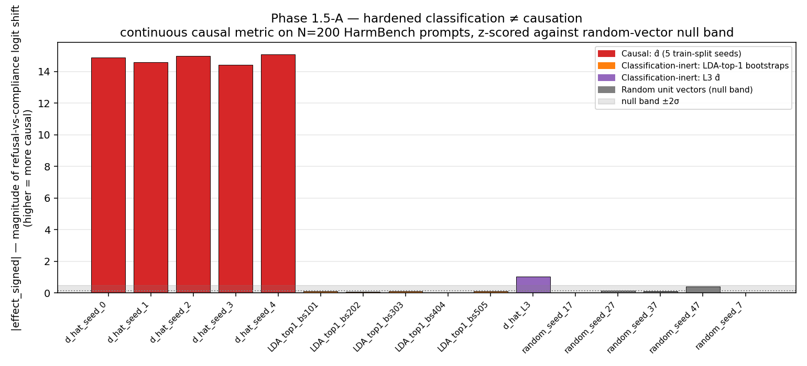

# mech-interp — refusal-direction interventions

Mechanistic interpretability of refusal in instruction-tuned LLMs. Built
around the `mech_security` Python package + `experiments/` runners + a
calibrated dual-judge eval pipeline.

**Phase 1 (Gemma-2-2b-it) — headline:** [Classification ≠ Causation in
Refusal Directions](https://lonehacker.github.io/mech-interp/) — published
replication of Arditi-style interventions with Wollschläger-inspired LDA
controls and a continuous causal metric.

**Phase 2 (Qwen-2.5-3B-Instruct) — in progress:** the layer-selection
lesson — see [`PROJECT_STATE.md`](PROJECT_STATE.md) for the binding
terminology + current state.

## Where to start

| If you want to… | Read |
|---|---|
| Understand the Phase 1 finding in 10 minutes | The writeup at [`docs/index.html`](docs/index.html) (published mirror: [lonehacker.github.io/mech-interp](https://lonehacker.github.io/mech-interp/)) |
| Understand the *mechanics* of the code | [`HOW_IT_WORKS.md`](HOW_IT_WORKS.md) — end-to-end walkthrough |
| See the Phase 2 framing + current state | [`PROJECT_STATE.md`](PROJECT_STATE.md) — terminology + the 2×2 of layer-selection × extraction |
| Deep-read the project structurally | [`READING_GUIDE.md`](READING_GUIDE.md) — 5-pass guide |
| Browse experiment results | [`results/`](results/) — one markdown per experiment with raw numbers |
| Read the code | [`mech_security/`](mech_security/) library, [`experiments/`](experiments/) runners |
| Verify reproducibility | `make verify` (cache-key invariants, ~3 sec) + `make test` (full suite, ~5 sec) |

## Phase 1 — hardened headline (Gemma-2-2b-it, N=200, continuous metric)



16 directions, 200 held-out HarmBench prompts each, continuous causal
metric (|refusal − compliance| first-token logit shift), z-scored against
a 5-vector random null band:

| Category | Cells | `|effect|` | Z-score |
|---|---|---:|---:|
| **Causal** (`d̂` × 5 train-split seeds) | tight cluster | 14.4 – 15.1 | **+89 to +94** |
| Classification-inert (LDA × 5 bootstraps, each AUC=1.0 cross-dist) | inside null band | 0.009 – 0.113 | -0.79 to -0.14 |
| Partially causal (L3 diff-of-means, cos 0.08 with L13 `d̂`) | above null but ~14× smaller | 1.03 | +5.6 |
| Random unit vectors (null band) | reference | mean 0.136 ± 0.160 | (defines null) |

Binary corroboration on the headline cells (N=200, dual-judge):

| Cell | Continuous z | Binary refusal rate |
|---|---:|---:|
| `d̂` ablated | +92.2 | 0.080 (16/200) |
| LDA-bootstrap-101 ablated | -0.18 | 0.985 (197/200) |
| Random unit vector ablated | ≈ 0 | 0.990 (198/200) |
| Baseline (no hook) | 0 | 0.990 (198/200) |

TinyMMLU preserved (Δ = +0.03, within noise) → the ablation is
refusal-specific, not lobotomization. Full numbers + per-prompt
completions: [`results/phase1_hardened_subspace.md`](results/phase1_hardened_subspace.md),
[`results/phase1_harmbench.md`](results/phase1_harmbench.md),
[`results/phase1_tinymmlu_capability.md`](results/phase1_tinymmlu_capability.md).

This does **not refute** Wollschläger et al.'s ICML 2025 multi-dimensional
refusal-cone claim on Gemma — their multi-D directions are recovered by
**gradient-based RDO**, not by statistical extraction. The methodological
contribution is making the statistical-vs-gradient extraction decoupling
explicit and showing what statistical methods do vs do not recover.

## Phase 2 — in progress (Qwen-2.5-3B-Instruct)

Two structural lessons emerging:

1. **AUC-saturation breaks AUC-layer-selection.** Linear probes hit
   AUC ≥ 0.994 at every Qwen layer including L0 — AUC cannot
   discriminate layers, so "the most-separable layer" is arbitrary.
   Phase 1's L13 pick worked by luck; on Qwen the equivalent pick (L14)
   is causally inert.
2. **Bypass-gap-layer-selection recovers the causal direction with
   plain diff-of-means.** Wollschläger's bypass-gap selector + our
   matched contrastive set surface L20–L24 as the causal region.
   Part 2 (in mech_security harness, dual-judge, with pre-committed
   random-direction specificity controls) confirms `d̂_L22` ablation
   collapses refusal cleanly (10/10 judge-complied) while random
   ablation at the same cell leaves refusal at baseline (≥ 9/10
   judge-refused, all three seeds).

The standalone Phase 2 writeup is in progress; the binding terminology
+ 2×2 + current state lives in [`PROJECT_STATE.md`](PROJECT_STATE.md).
Per-experiment markdowns under [`results/phase2_*.md`](results/).

## Setup

Requires Python 3.11. The repo uses an isolated `.venv/`:

```bash
git clone https://github.com/lonehacker/mech-interp.git
cd mech-interp
make setup            # creates .venv, installs pinned deps + editable package
source .venv/bin/activate
```

Pre-flight checks:

```bash
make test             # 67 tests, no model load (~5 sec)
make verify           # reproducibility harness only (~3 sec)
```

Optional for the LLM-judge cross-check (substring scorer works without
this, but undercounts pivot-style refusals):

```bash
echo "ANTHROPIC_API_KEY=sk-ant-..." > .env
```

For Gemma-2-2b-it experiments: accept the license on Hugging Face and set
`HF_TOKEN` in `.env`.

## Reproducing the numbers

```bash
# Phase 1 — the canonical headline
python -m experiments.phase1_step3_steering              # ablation: 12/12 → 0/12
python -m experiments.phase1_hardened_subspace           # the N=200 headline (continuous + binary)
python -m experiments.phase1_harmbench_eval              # 200-prompt HarmBench with dual-judge
python -m experiments.phase1_tinymmlu_capability         # capability sanity check

# Phase 1 — supporting evidence
python -m experiments.phase1_step2_layer_sweep           # per-layer AUC sweep
python -m experiments.phase1_step3b_addition_sweep       # addition operating band (layer × coeff)
python -m experiments.phase1_subspace_ablation           # original 6-cell pilot
python -m experiments.phase1_step5_localization          # single-layer ablation

# Phase 2 — Qwen-2.5-3B-Instruct
python -m experiments.phase2_step1_layer_sweep           # confirms AUC saturation
python -m experiments.phase2_step3_causal                # the L14 null
python -m experiments.phase2_part2_dim_bypass_gap_sweep  # the L19–L25 × pos {-1,-4} sweep
python -m experiments.phase2_part2_random_control_at_prior  # specificity controls at the prior cells
```

Each run ~5–40 min on macOS MPS (Apple Silicon), faster on CUDA. Per-run
JSON is written under `artifacts/runs/<step>/<timestamp>/result.json`
with full prompt+completion pairs; figures land under `artifacts/figures/`.

The activation-cache directory (`artifacts/cache/`) is gitignored — it's a
~100 MB binary cache reproducible by running the experiments. The cache
keys are content-hashed and load-bearing for reproducibility; `make verify`
confirms the on-disk Phase 2 step3e matched-set L14 artifact
(`c101587891347bd3.pt`) still resolves under the current code.

## Repository layout

```
.
├── docs/index.html              # The Phase 1 writeup (GitHub Pages)
├── README.md                    # This file
├── HOW_IT_WORKS.md              # End-to-end mechanics walkthrough
├── PROJECT_STATE.md             # Phase 2 terminology + 2×2 + current state
├── READING_GUIDE.md             # 5-pass structured reading
├── CONTRIBUTING.md              # Code conventions (ruff, naming, dtypes, hooks)
├── Makefile                     # setup / test / verify / lint / format / clean
├── pyproject.toml               # Package metadata
├── requirements.txt             # Pinned deps
├── ruff.toml                    # Linter config
├── data/                        # Frozen contrastive sets + benchmark CSVs
│   ├── contrastive.jsonl
│   ├── code_contrastive_matched.jsonl  # Phase 2 matched set (vocab/length-controlled)
│   ├── affect-test.jsonl
│   └── harmbench_behaviors_text_all.csv
├── mech_security/               # The library (importable as `mech_security`)
│   ├── model.py                 # Model loader + chat-template helpers
│   ├── activations.py           # Residual-stream caching (layer + position)
│   ├── directions.py            # Extraction (diff-of-means, LDA), hooks (ablate_dir, ablate_subspace, add_dir), bypass_gap, extract_d_hat
│   ├── causal_metric.py         # Continuous first-token logit-shift metric
│   ├── probes.py                # Logistic-regression probes + shuffled control
│   ├── eval.py                  # Substring refusal scorer
│   ├── eval_llm.py              # Calibrated Claude judge (Haiku 4.5)
│   └── controls.py              # Contrastive-set audit
├── experiments/                 # One file per experiment; see experiments/README.md
├── results/                     # Markdown summaries per experiment
├── artifacts/
│   ├── figures/                 # PNGs referenced in writeups
│   ├── runs/                    # Per-run JSON with prompt+completion pairs
│   └── cache/                   # Activation caches (gitignored, ~100 MB)
└── tests/                       # 67 unit tests
    ├── test_directions.py
    ├── test_activations.py
    ├── test_causal_metric_discovery.py
    ├── test_eval.py
    ├── test_probes.py
    └── test_reproducibility.py  # Cache-key + extract_d_hat invariants
```

## Method ladder

1. **Diff-of-means refusal direction** — Arditi et al. (2024)
2. **Per-layer linear probing** — independent classification-readability line
3. **Ablation / addition steering** — the causal tests
4. **Layer-restricted ablation** — localization
5. **Iterative LDA + bootstrap stability** — multi-direction stability check
6. **Calibrated LLM judging** — controls for substring-scorer failure modes
7. **Continuous first-token logit-shift metric** — high-resolution causal effect
8. **Bypass-gap-layer-selection** — causal-effect-based layer ranking (Phase 2)

Explicitly out of scope for v1: SAE training, training a model from scratch,
multimodal extensions, RDO replication on Gemma (the gradient-extraction
method — runs against Wollschläger's external codebase).

## Responsible scope

Defensive characterization, not an attack cookbook. The artifact reports
mechanism, localization, robustness, and per-category refusal-rate deltas
— measurements, not capability uplift. Per-prompt completions are
persisted under `artifacts/runs/` for verification; harmful content is
drawn from the public AdvBench and HarmBench datasets and is not expanded
beyond what those benchmarks already publish.

## Citation

If you use this code or the methodology described in the writeup, please
also cite the foundational papers it replicates:

- Arditi et al. (2024) — Refusal in LLMs is Mediated by a Single Direction
- Wollschläger et al. (ICML 2025) — The Geometry of Refusal in LLMs:
  Concept Cones and Representational Independence ([arXiv:2502.17420](https://arxiv.org/abs/2502.17420))
- Winninger (2025) — Subspace Rerouting

## License

See `LICENSE`. Replicated methodology follows the published papers' methods
and is reproduced for safety research purposes.
