# Figures

13 figures referenced in [the writeup](https://lonehacker.github.io/mech-interp/)
and in [`results/`](../../results/). Grouped by role, not by alphabetical order.

## Headline figures (start here)

| Figure | Section in writeup | What it shows |
|---|---|---|
| 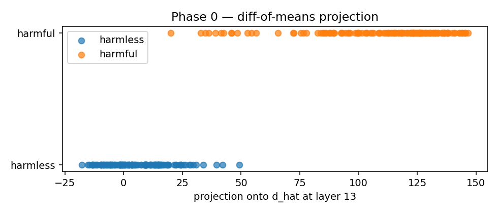 `phase0_projection.png` | §2 The mechanism | The "oh this works" moment. 15 harmful + 15 harmless prompts projected onto the diff-of-means direction at L13. Two visually-separated clusters — this single picture is the entire premise of the project. |
| 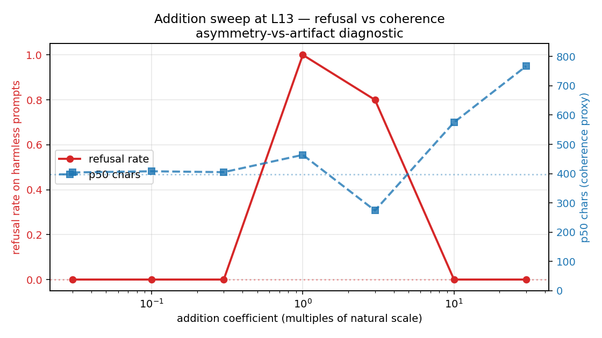 `phase1_step3b_diagnostic.png` | §4 Replication | THE diagnostic that resolved C4 from "asymmetric mechanism" to "tuning artifact." Refusal rate (red, left axis) rises BEFORE coherence (blue, right axis) collapses → addition works at the right coefficient. |
| 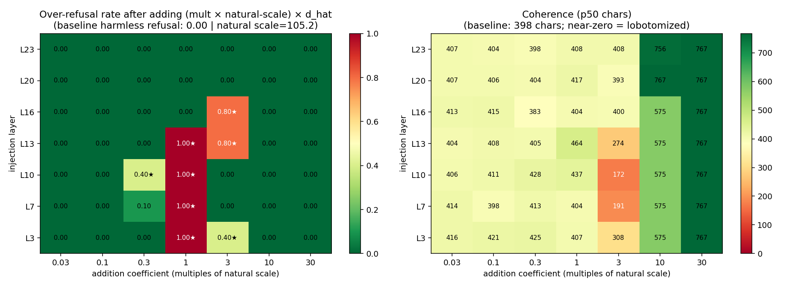 `phase1_step3b_addition_sweep.png` | §4 Replication | The full coefficient × injection-layer heatmap. Left: refusal rate. Right: coherence. ★ marks pass cells. Operating band L3–L16 visible at coefficient ~1.0× of natural scale. |
| 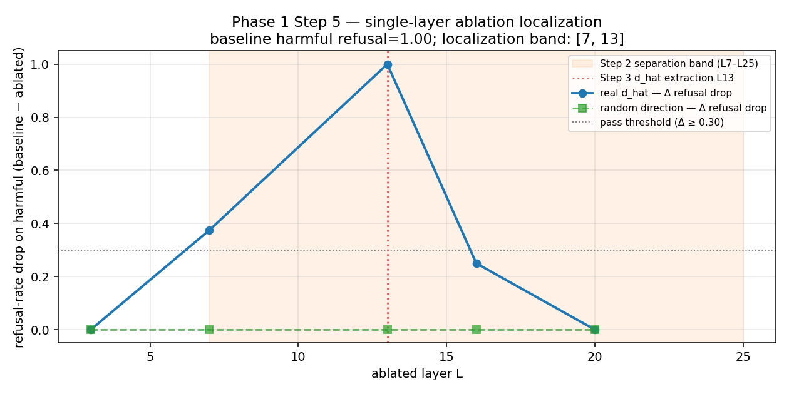 `phase1_step5_localization.png` | §4 Replication | Single-layer ablation: only L13 alone gives Δrefusal = +1.00. L7 partial, L3 / L20 inert. The behavioral-causal complement to the probe band. |

## Supporting figures — layer / probe / depth

| Figure | Section in writeup | What it shows |
|---|---|---|
| 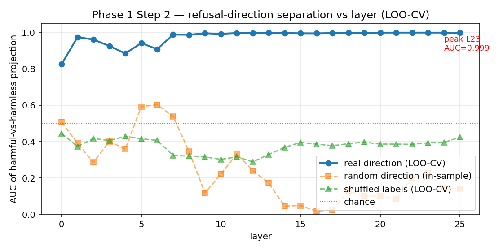 `phase1_step2_layer_sweep_advbench.png` | §3 Mechanism | Per-layer LOO-CV AUC of diff-of-means direction on AdvBench-derived contrastive set. Peak L23 (0.999); plateau L7–L25. Random + shuffled controls hug 0.4. |
| 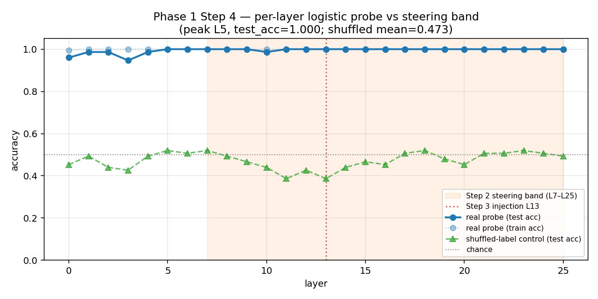 `phase1_step4_probe_by_layer.png` | §3 Mechanism | Logistic-regression probe accuracy by layer. Reaches 1.000 by L1, shuffled control hugs 0.5. Probe band wider than steering band — *readable* ≠ *causally used*. |
| 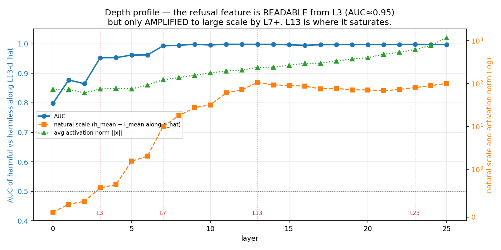 `phase1_depth_profile.png` | (mechanics analysis) | AUC, natural scale, and \|\|x\|\| at each layer using L13 d_hat. AUC ~0.95 by L3, but scale only 105 by L13 — readable early, "loud" mid-network. |

## Supporting figures — direction-similarity / multi-D question

| Figure | Section in writeup | What it shows |
|---|---|---|
| 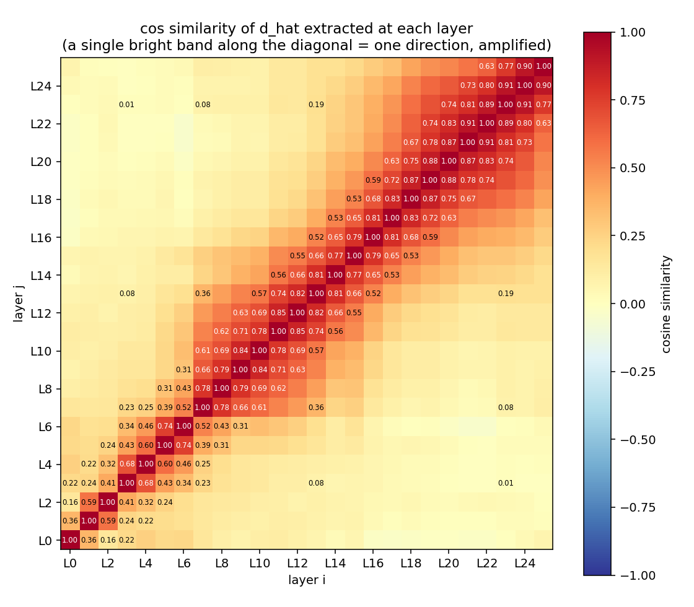 `phase1_dhat_per_layer_cossim.png` | §3 The headline | 26×26 cosine-similarity heatmap of per-layer diff-of-means directions. Not uniformly bright — per-layer d_hat picks DIFFERENT directions. cos(d_hat@L3, d_hat@L13) ≈ 0.08. |
| 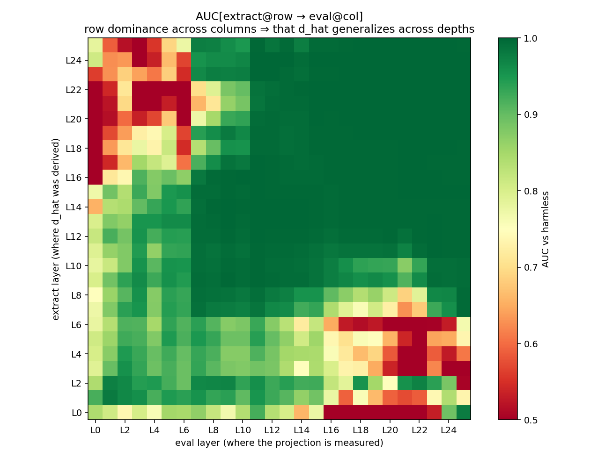 `phase1_dhat_transfer_auc.png` | §3 The headline | "d_hat extracted at row → evaluated at col" AUC matrix. Row 13 (L13 d_hat) works at every layer; other rows degrade. L13 direction is privileged. |

## Cross-harm generality

| Figure | Section in writeup | What it shows |
|---|---|---|
| 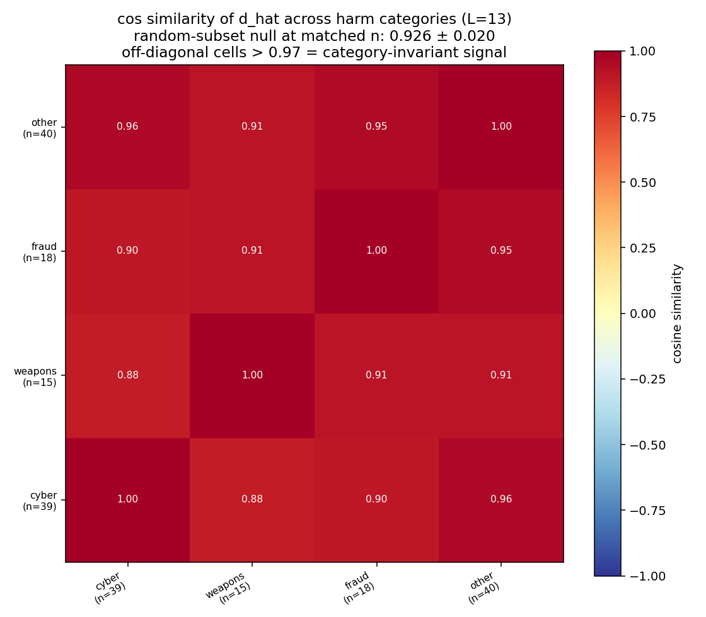 `phase1_cross_harm_cossim.png` | §5 Cross-harm | d_hat extracted from each category (cyber / weapons / fraud / other) at L13. Off-diagonal cos ≈ 0.92, matched-size null ≈ 0.97. Mostly unitary across harm types. |
| 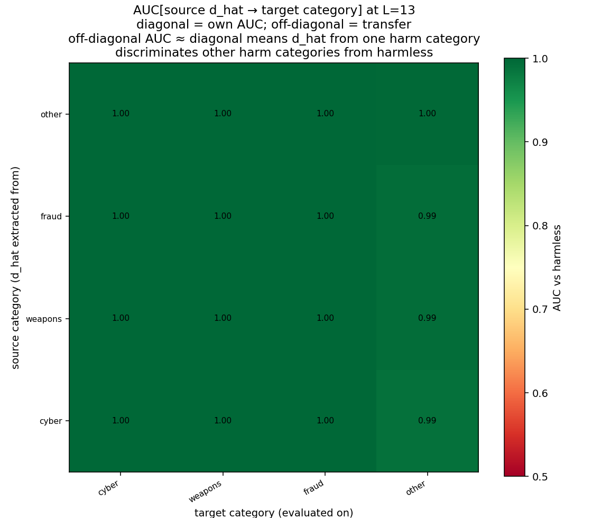 `phase1_cross_harm_auc.png` | §5 Cross-harm | Transfer AUC: d_hat from category-i evaluated on category-j prompts. Off-diagonal AUC ≈ 0.996. An attacker needs ONE category's contrastive set to discriminate all categories. |
| 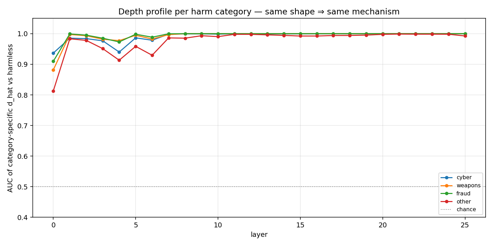 `phase1_per_category_depth_profile.png` | §5 Cross-harm | Per-category AUC depth profile. Every category traces approximately the same shape — same mechanism. |

## Superseded figure (kept for completeness)

| Figure | Why superseded |
|---|---|
| `phase1_step2_layer_sweep.png` | Layer sweep on the original 15+15 hand-written set from Phase 0. Superseded by `phase1_step2_layer_sweep_advbench.png` (same analysis on the frozen 150+150 AdvBench-derived contrastive set). The newer figure is what the writeup references. |

## How these are generated

Each figure is produced by one of the experiment runners under
[`experiments/`](../../experiments/). The runners save figures alongside
their result JSON. If you re-run an experiment, the figure regenerates.

| Figure file | Generated by |
|---|---|
| `phase0_projection.png` | `experiments/phase0_trigger.py` |
| `phase1_step2_layer_sweep*.png` | `experiments/phase1_step2_layer_sweep.py` |
| `phase1_step3b_*.png` | `experiments/phase1_step3b_addition_sweep.py` |
| `phase1_step4_probe_by_layer.png` | `experiments/phase1_step4_probing.py` |
| `phase1_step5_localization.png` | `experiments/phase1_step5_localization.py` |
| `phase1_depth_profile.png`, `phase1_dhat_*.png`, `phase1_cross_harm_*.png`, `phase1_per_category_depth_profile.png` | `experiments/phase1_mechanics_and_generality.py` |
